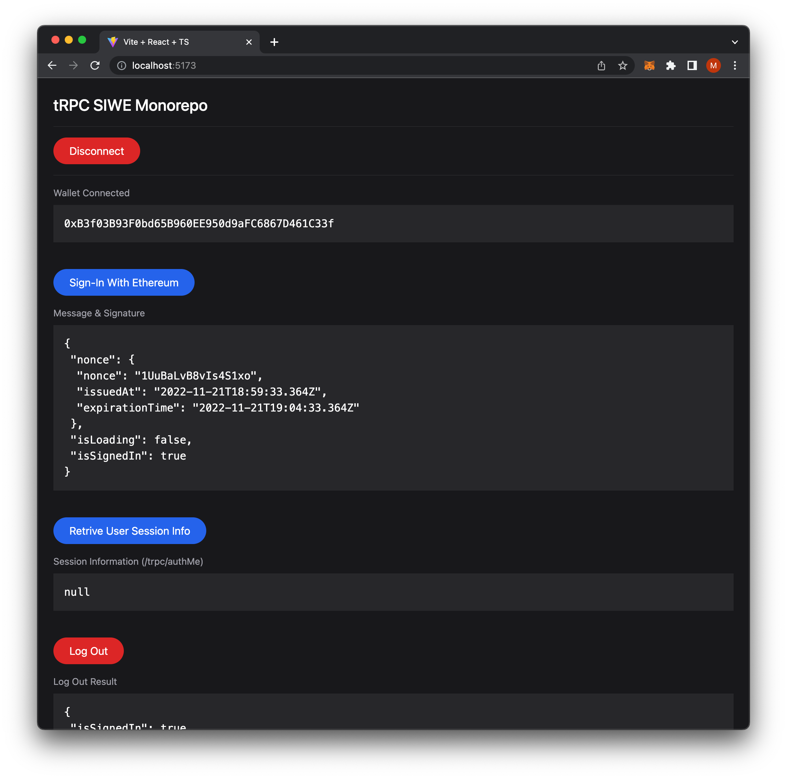

# tRPC SIWE Monorepo

This is a project that demonstrates using Sign-In With Ethereum with tRPC using a monorepo setup with lerna.

There will also be a YouTube video for this entire tutorial (coming soon).

## Preview



## Requirements

- NVM or node v18.12.1
- pnpm v7.15.0

## Setup

Environment variables need to be setup.

```bash
# From ./ (root directory)

# React Frontend
cp ./packages/react/.env.local.example ./packages/react/.env.local;

# tRPC Backend
cp ./packages/trpc/.env.example ./packages/trpc/.env;
```

Install & start entire application:

```bash
pnpm install;
pnpm run dev;

# Expected Output:
# [nodemon] 2.0.20
# [nodemon] to restart at any time, enter `rs`
# [nodemon] watching path(s): *.*
# [nodemon] watching extensions: ts,json
# [nodemon] starting `ts-node --files src/server.ts`
#   VITE v3.2.4  ready in 307 ms
#   ➜  Local:   http://localhost:5173/
#   ➜  Network: use --host to expose
# Listening on port 5001.
```

